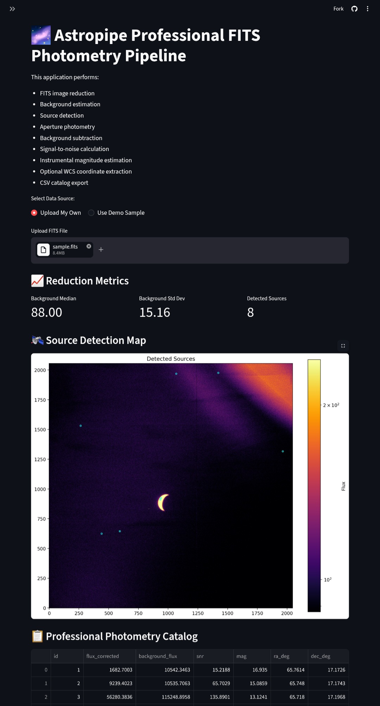

# Astropipe: Professional Astronomical Data Pipeline

Astropipe is a research-grade pipeline designed for the reduction and photometric analysis of astronomical FITS data. I developed this tool to automate the transition from raw telescope imagery to structured, scientific-grade catalogs.

### Scientific Capabilities
* **Automated Data Reduction:** Performs 3-sigma clipped background estimation and utilizes Gaussian smoothing to enhance signal detection in noisy datasets.
* **Research-Grade Photometry:** Implements aperture-based photometry with local background annulus subtraction, ensuring accurate flux measurement and instrumental magnitude calibration: `m = ZeroPoint - 2.5 * log10(Flux_corrected)`.
* **WCS Coordinate Extraction:** Automatically interprets FITS headers to map pixel-space detections to celestial RA/Dec coordinates.
* **Data Quality Control:** Calculates Signal-to-Noise Ratio (SNR) for every source to distinguish genuine detections from instrumental noise.
* **Interactive Exploration:** Provides real-time filtering, magnitude distribution histograms, and SNR analysis.

### Technical Stack
* **Language:** Python
* **Scientific Libraries:** `Astropy` (WCS/FITS), `Photutils` (DAOStarFinder/Photometry), `SciPy` (Smoothing), `NumPy`, `Pandas`, `Matplotlib`
* **Deployment:** `Streamlit` (Web-based dashboard)

### Why this pipeline is unique
I built this pipeline to handle the complexities of real-world astronomical datasets, such as handling `NaN` values, filtering edge-margin noise, and managing multidimensional data. Unlike basic detection tools, Astropipe is engineered for reproducibility and scientific accuracy, making it suitable for both educational research and small-scale survey analysis.

### Usage
1. Upload a FITS file (`.fits`, `.fit`, or `.fits.gz`).
2. Adjust the **Detection Threshold** and **FWHM** in the sidebar to match your telescope's PSF (Point Spread Function).
3. Use the **Catalog Filtering** controls to refine your sample based on magnitude.
4. Export the resulting photometry as a CSV for further analysis in tools like Topcat or DS9.

---
*Built to bridge the gap between raw telescope data and reproducible scientific analysis.*

### Pipeline Preview

